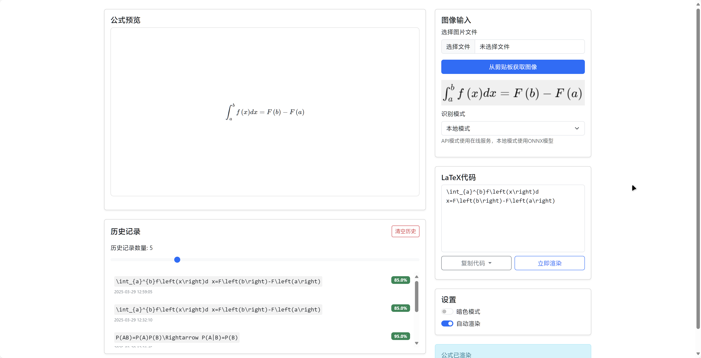

# FMatPix Web - 数学公式识别Web应用



## 项目概述

FMatPix Web是基于Flask的数学公式识别Web应用，提供两种识别模式：
1. **API模式**：使用火山引擎Doubao-vision-lite-32k大模型
2. **本地模式**：使用FMatPix项目提供的公式定位模型和公式识别模型，此方式需要配置对应深度学习环境，涉及pytorch-cuda等拓展库体积很大，打包后会体积也非常臃肿，因此只建议涉猎深度学习的用户使用，这样无需二次配置环境节省大量空间。

## 功能特点

- 支持图片上传和剪贴板粘贴识别
- 实时LaTeX渲染预览及修改
- 历史记录管理
- 暗色/亮色主题切换
- 自动渲染开关
- 置信度显示❌（这是我从之前我的项目迁移的，目前的置信度是定值，无参考意义）
- 多种复制格式选项

## 安装指南

### 系统要求
- Python 3.8+
- pip

### 安装步骤
1. 克隆仓库：
```bash
git clone https://github.com/yourusername/fmatpix_web.git
cd fmatpix_web
```

2. 安装依赖：
```bash
pip install -r requirements.txt
```

## 配置指南

### API模式配置
1. 访问[火山方舟管理控制台](https://console.volcengine.com/ark/region:ark+cn-beijing/experience/chat)
2. 开通Doubao-vision-lite-32k或其他视觉模型
3. 获取API Key
4. 修改app.py中的配置：
```python
client = OpenAI(
    base_url="https://ark.cn-beijing.volces.com/api/v3",
    api_key="your_api_key_here",  # 替换为你的API Key
)
```

> [!NOTE]
>
> 此方式借助openai的sdk，因此对于市面上现存的视觉模型api理论都是可以支持替代的。这些视觉大模型的价格相较于目前转向收费的SimpleTex要便宜划算许多，并且不用不扣费。

### 本地模式配置

1. 从[FMatPix项目](https://github.com/ai25395/FMatPix)下载模型
2. 在项目目录创建models文件夹，将下载的模型文件放入models文件夹
4. 通过torch检测cuda，若未配置则使用cpu进行推理（速度较慢）：


## 使用说明

1. 启动应用：
```bash
python app.py
```

2. 浏览器访问 http://127.0.0.1:5000

3. 使用方式：
- 选择识别模式（API/本地）
- 上传图片或从剪贴板粘贴
- 查看识别结果和置信度
- 编辑LaTeX代码
- 复制结果到剪贴板

## 项目结构

```
fmatpix_web/
├── app.py                # Flask主程序
├── models.py             # ONNX模型加载
├── processor.py          # 图像预处理
├── utils.py              # 批量推理和后处理
├── templates/
│   └── index.html        # 前端界面
├── static/               # 静态资源
├── models/               # ONNX模型存放目录
└── assets.README/        # README资源
```

## 许可证

MIT License
